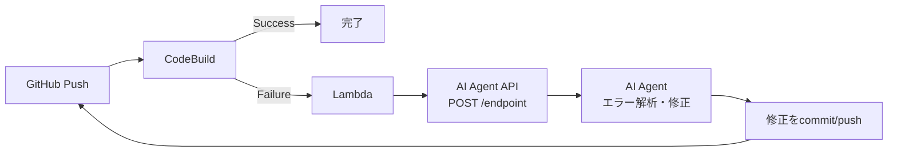

# AI Agent API 仕様書

## 概要

CodeBuildのビルドが失敗した時のみ、AI AgentにエラーログをPOSTで送信します。
成功時は何も送信しません。

## フロー



## API仕様

### エンドポイント

```
POST {AI_AGENT_ENDPOINT}
```

### リクエストヘッダー

```json
{
  "Content-Type": "application/json"
}
```

**注**: API認証が必要な場合のみ、`Authorization: Bearer {API_KEY}` ヘッダーを追加

### リクエストボディ

```json
{
  "buildStatus": "FAILED",
  "buildId": "frexida-app-pipeline:abc12345-6789-def0-1234-567890abcdef",
  "projectName": "frexida-app-pipeline",
  "logGroup": "/aws/codebuild/frexida-app-pipeline",
  "logStream": "abc12345-6789-def0-1234-567890abcdef",
  "errorLogs": "npm ERR! code ELIFECYCLE\nnpm ERR! errno 1\n...",
  "commitHash": "a1b2c3d",
  "branch": "main",
  "retryCount": 0,
  "timestamp": "2025-12-12T10:30:45.123Z"
}
```

### フィールド説明

| フィールド | 型 | 説明 |
|-----------|-----|------|
| buildStatus | string | 常に "FAILED" |
| buildId | string | CodeBuildのビルドID |
| projectName | string | CodeBuildプロジェクト名 |
| logGroup | string | CloudWatch LogsのLog Group名 |
| logStream | string | CloudWatch LogsのLog Stream名 |
| errorLogs | string | エラーログの抜粋（最大500行、エラー前後のコンテキスト含む） |
| commitHash | string | Git commit hash (短縮形7文字) |
| branch | string | Gitブランチ名 |
| retryCount | number | 現在のリトライ回数（0から開始） |
| timestamp | string | ISO 8601形式のタイムスタンプ |

### レスポンス

AI Agentは以下のレスポンスを返すことを期待：

#### 成功時 (HTTP 200)
```json
{
  "status": "acknowledged",
  "message": "Error received and processing"
}
```

AI Agentは受信確認後、非同期で:
1. エラーログを解析
2. 修正パッチを生成
3. GitHubにcommit/push
4. これにより新しいビルドが自動トリガーされる

#### エラー時 (HTTP 4xx/5xx)
```json
{
  "error": "Invalid API key"
}
```

## 重要な仕様

### リトライ制限
- 最大リトライ回数: 3回（設定可能）
- リトライ回数が上限に達したら通知のみ送信し、それ以上のリトライは行わない

### タイムアウト
- API呼び出しタイムアウト: 30秒
- Lambda関数全体のタイムアウト: 60秒

### ログ取得
- エラーログは最大500行
- エラーキーワード（ERROR, FAILED, Exception等）の前後行を含む
- エラーが見つからない場合は最後の100行を送信

### セキュリティ
- HTTPS通信必須
- API認証はオプション（必要な場合のみBearer認証）
- 認証情報が必要な場合はAWS Secrets Managerで管理

## AI Agent側の実装要件

### 必須要件
1. POSTリクエストを受け付けるエンドポイント
2. 200 OKレスポンスの返却（受信確認）
3. HTTPSエンドポイント

### 推奨実装
1. 非同期処理でエラーログ解析
2. 最小限の修正パッチ生成
3. GitHub APIを使用したcommit/push
4. コミットメッセージに自動修正であることを明記

### コミットメッセージ例
```
[AUTO-FIX] Fix npm dependency error (retry 1)

Automatically fixed by AI agent based on build failure analysis.
Build ID: frexida-app-pipeline:abc12345-6789-def0-1234-567890abcdef
```

## 実装例 (Python)

```python
from flask import Flask, request, jsonify
import logging

app = Flask(__name__)
logger = logging.getLogger(__name__)

@app.route('/ci_result', methods=['POST'])
def handle_build_failure():
    # Optional: Verify API key if authentication is required
    # auth_header = request.headers.get('Authorization', '')
    # if auth_header and not validate_api_key(auth_header):
    #     return jsonify({'error': 'Invalid API key'}), 401

    # Parse request
    data = request.json
    build_id = data.get('buildId')
    error_logs = data.get('errorLogs')
    branch = data.get('branch')
    retry_count = data.get('retryCount')

    logger.info(f"Received build failure: {build_id}")
    logger.info(f"Branch: {branch}, Retry: {retry_count}")

    # Acknowledge receipt immediately
    response = {
        'status': 'acknowledged',
        'message': 'Error received and processing'
    }

    # Queue for async processing
    # queue_error_analysis(data)

    return jsonify(response), 200
```

## テスト用curl

```bash
curl -X POST https://your-api-endpoint.com/ci_result \
  -H "Content-Type: application/json" \
  -d '{
    "buildStatus": "FAILED",
    "buildId": "test-build-123",
    "projectName": "test-project",
    "logGroup": "/aws/codebuild/test-project",
    "logStream": "test-stream",
    "errorLogs": "Error: Module not found",
    "commitHash": "abc123",
    "branch": "main",
    "retryCount": 0,
    "timestamp": "2025-12-12T10:30:45.123Z"
  }'
```