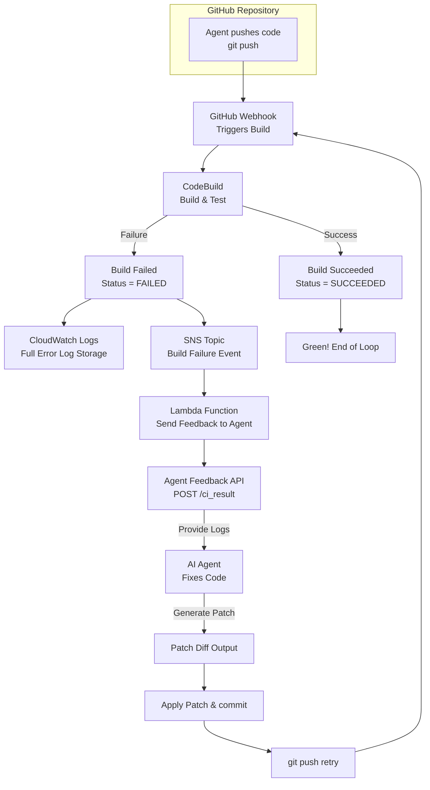

# Self-Healing CI/CD Pipeline Module

This Terraform module creates a self-healing CI/CD pipeline using AWS CodeBuild with AI-powered automatic error correction.

## Architecture



## Features

- **Automated Build Triggers**: GitHub webhook integration for automatic builds on push
- **AI-Powered Error Correction**: Automatic analysis and fixing of build failures
- **Cost Optimization**: Designed to stay under 3,000 JPY/month
- **Retry Protection**: Maximum retry limit to prevent infinite loops
- **Comprehensive Monitoring**: CloudWatch dashboards and alarms
- **Security**: Secrets stored in AWS Secrets Manager

## Usage

```hcl
module "self_healing_cicd" {
  source = "../modules/self-healing-cicd"

  environment         = "production"
  aws_region          = "ap-northeast-1"
  account_id          = "123456789012"

  project_name        = "my-app-pipeline"
  github_repository   = "https://github.com/myorg/myrepo.git"
  github_branch       = "main"
  github_token        = var.github_token

  ai_agent_endpoint   = "https://ai-agent.example.com/ci_result"
  ai_agent_api_key    = var.ai_agent_api_key

  build_compute_type  = "BUILD_GENERAL1_SMALL"
  max_retry_count     = 3
  log_retention_days  = 7
}
```

## Required Permissions

The GitHub token requires the following permissions:
- `repo` - Full control of private repositories
- `write:packages` - Upload packages (optional)

## Cost Breakdown

| Service | Monthly Cost (Est.) | Notes |
|---------|-------------------|-------|
| CodeBuild | 1,875 JPY | 500 builds × 5 min × $0.005/min |
| CloudWatch Logs | 84 JPY | 1GB ingestion, 7-day retention |
| Secrets Manager | 180 JPY | 3 secrets |
| Lambda | < 1 JPY | Free tier |
| DynamoDB | < 10 JPY | On-demand pricing |
| **Total** | **~2,150 JPY** | Under 3,000 JPY budget |

## AI Agent API

The AI agent must implement the following endpoint:

### POST /ci_result

**Request:**
```json
{
  "build_id": "project:abc123",
  "project_name": "my-app-pipeline",
  "commit_hash": "a1b2c3d",
  "branch": "main",
  "error_logs": "npm ERR! ...",
  "build_metadata": {
    "start_time": "2025-12-12T10:30:00Z",
    "end_time": "2025-12-12T10:35:00Z",
    "retry_count": 0
  }
}
```

**Response (Success):**
```json
{
  "action": "retry_with_patch",
  "patch": "diff --git a/package.json...",
  "description": "Fixed missing dependency",
  "confidence": 0.85
}
```

**Response (Manual Intervention):**
```json
{
  "action": "manual_intervention_required",
  "reason": "Complex issue requiring human review",
  "suggestions": ["Check database configuration"]
}
```

## Monitoring

Access the CloudWatch dashboard to monitor:
- Build success/failure rates
- Average build duration
- Retry counts
- AI agent invocations
- Cost metrics

## Troubleshooting

### Build not triggering
1. Verify webhook URL is configured in GitHub
2. Check CodeBuild project has correct source configuration
3. Verify GitHub token has necessary permissions

### Lambda function not executing
1. Check CloudWatch Events rule is enabled
2. Verify SNS subscription is active
3. Check Lambda function logs in CloudWatch

### AI agent not responding
1. Verify endpoint URL is correct
2. Check API key is valid
3. Review Lambda function logs for errors

## Security Considerations

- All sensitive data stored in AWS Secrets Manager
- IAM roles follow least privilege principle
- GitHub webhook can use optional secret for validation
- Build artifacts never exposed publicly

## Contributing

To contribute to this module:
1. Follow existing Terraform patterns
2. Update documentation for any changes
3. Test thoroughly with different scenarios
4. Consider cost implications of changes